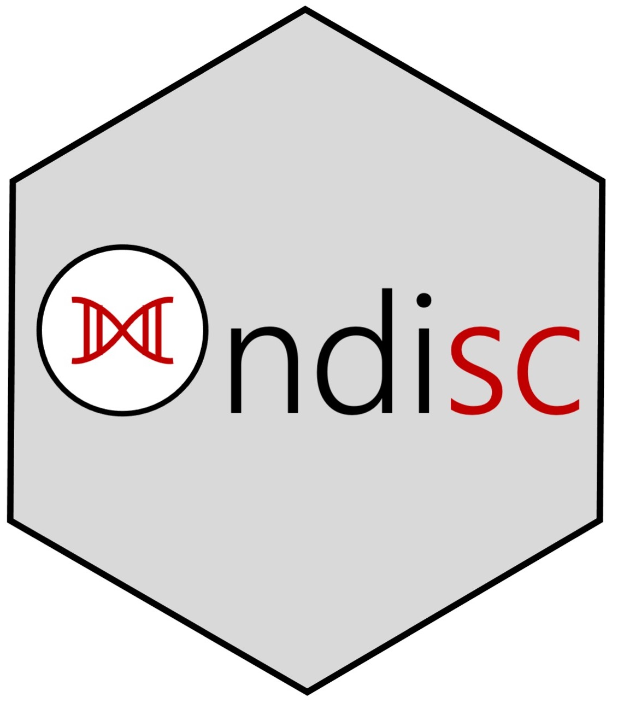

<!-- README.md is generated from README.Rmd. Please edit that file -->

# `ondisc`: large-scale computing on single-cell data 

<!-- badges: start -->

[](https://travis-ci.com/timothy-barry/ondisc)
[](https://codecov.io/gh/Timothy-Barry/ondisc?branch=main)
<!-- badges: end -->

Single-cell datasets are growing in size, posing challenges as well as
opportunities to biology researchers. `ondisc` (short for “on-disk
single cell”) is an R package that enables users to easily and
efficiently analyze large-scale single-cell data. `ondisc` makes
computing on large-scale single-cell data **FUN**:

  - **Fast**: `ondisc` is powered by several novel, highly efficient
    algorithms and data structures. All low-level code is written in C++
    or C for maximum performance.
  - **Universal**: `ondisc` runs on all platforms, from laptops to
    supercomputers. `ondisc` works seamlessly when the size of the data
    exceeds the amount of available memory.
  - **Ntuitive**: `ondisc` leverages ideas from functional programming,
    making it simple for R users users to pick up and incorporate into
    their programs.

Take a look at the
[tutorials](https://timothy-barry.github.io/ondisc/articles/tutorial_odm_class.html)
on the [package
website](https://timothy-barry.github.io/ondisc/index.html).

## Installation

You can install the development version from GitHub with:

``` r
install.packages("devtools")
devtools::install_github("timothy-barry/ondisc")
```
